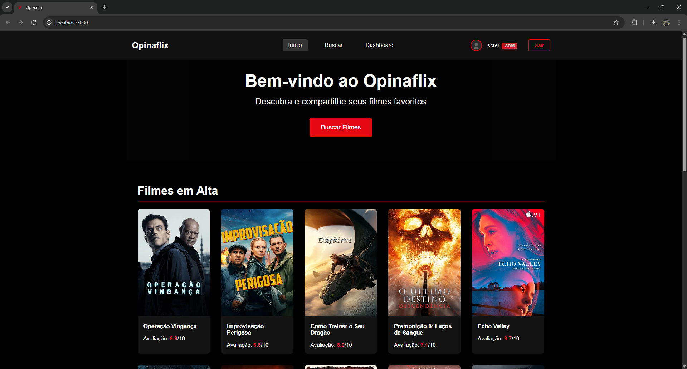
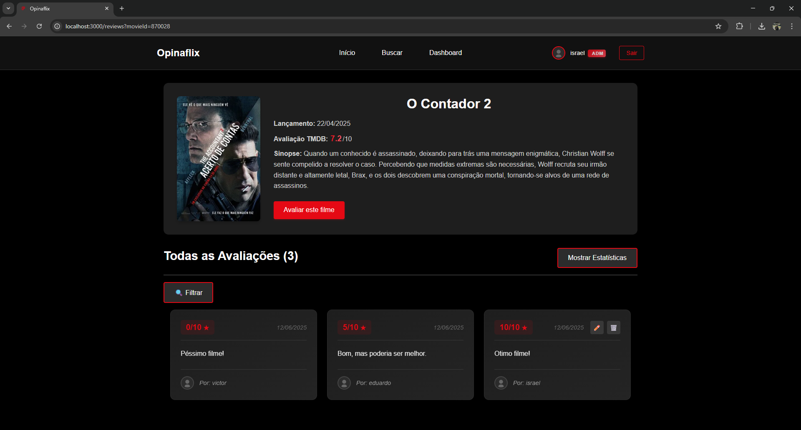
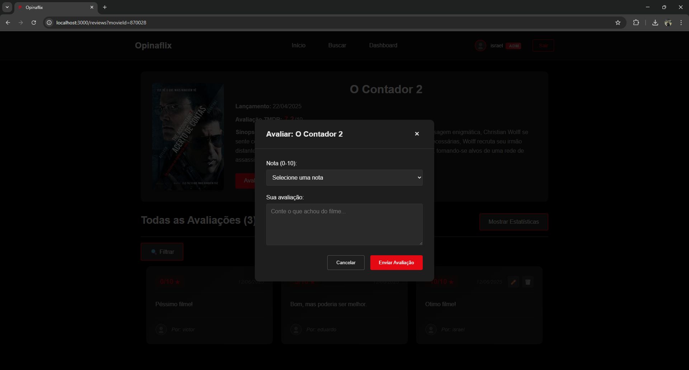
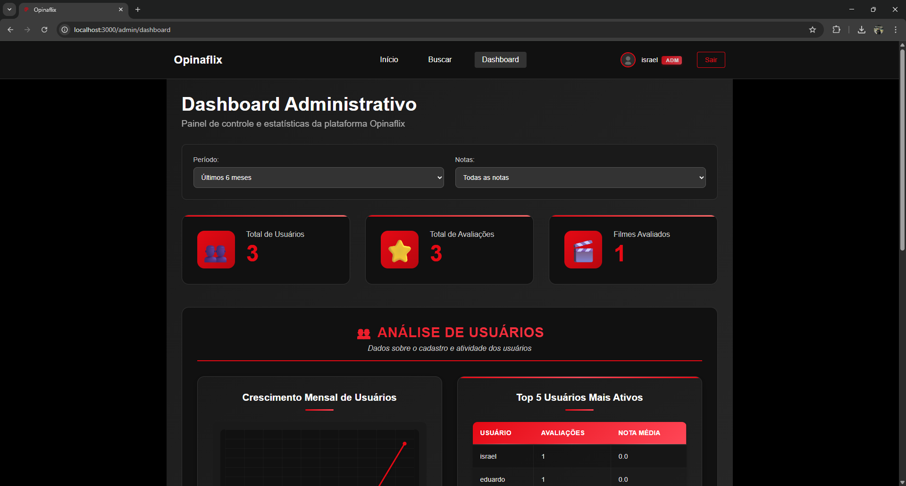
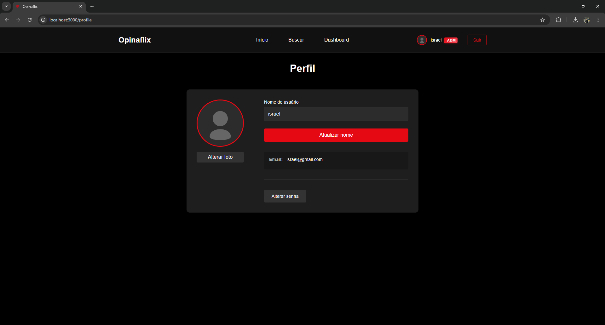

#  Opinaflix

Este projeto é uma **plataforma web** para consultar e registrar avaliações de filmes e séries, ajudando os usuários a decidir qual filme ou série assistir.

O sistema conta com funções como:
- **Busca de filmes e séries**
- **Criação e visualização de avaliações**
- **Sistema de login e sessão de usuário**
- **Personalização básica da conta do usuário**
- **Dashboard para administradores**

Todos os filmes e séries cadastrados na plataforma são fornecidos pela API do The Movie Database (TMDB).

---

## 🚀 Principais Tecnologias Utilizadas
- **HTML, CSS, JavaScript e React** para construção da interface de usuário de forma dinâmica e interativa
- **Node.js** responsável pela lógica e execução do backend
- **Next.js** para integração do frontend e backend
- **MySQL** usado para modelagem e armazenamento do banco de dados
- **Chart.js** para a criação de gráficos no dashboard

---

### 🏠 Página Inicial
Tela inicial do projeto, exibindo sugestões de filmes em alta, informações principais e atalhos para funcionalidades.

---

### 🔍 Página de Busca
Página para realizar buscas e encontrar filmes/séries de forma rápida.

---

### 📝 Página de Detalhes
Esta é a página de detalhes de um filme/série, onde é possível conferir algumas informações sobre o filme, visualizar as avaliações de outros usuários ou registrar a sua própria.

---

### ✏️ Avaliar
Ao clicar em _"Avaliar este filme"_, uma janela é exibida para que o usuário registre sua nota e adicione uma breve descrição.

---

### 📊 Dashboard (Disponível apenas para usuários administradores)
Aqui são exibidos alguns dados para administradores sobre os usuários e as avaliações da plataforma.
  

---

### 👤 Página de Usuário
Essa página é responsável pela personalização da conta do usuário, podendo ser alterada a foto de perfil, o nome e a senha da conta.

---

## 📌 Observações
- Todas as imagens apresentadas aqui são capturas de tela reais do projeto.
- O design prioriza **usabilidade**, **organização** e **clareza das informações**.
